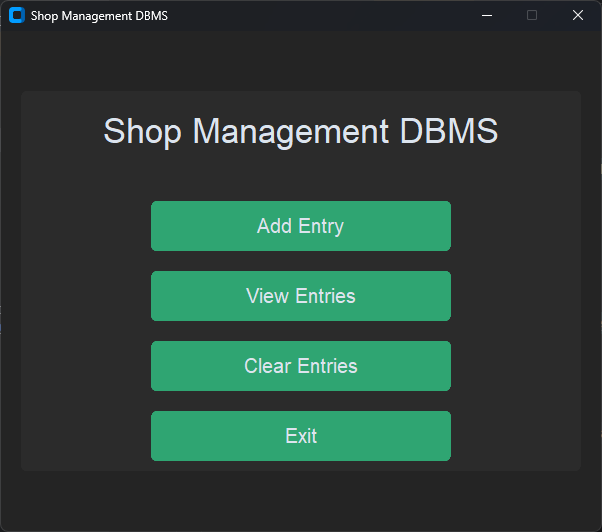
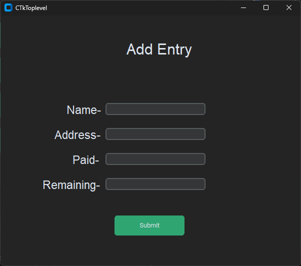
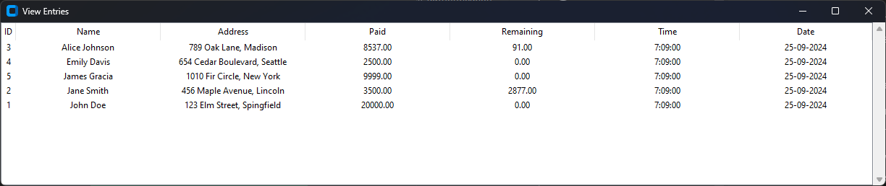
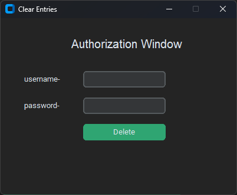
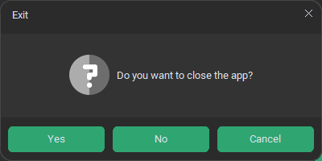

# Shop Management DBMS

This is a simple **Shop Management Database Management System (DBMS)** built using `Python` and `customtkinter`. It allows shopkeepers to manage customer entries, view records, and clear all records with authentication for data clearance.

## Features

- **Add Entry**: Add customer data including name, address, and transaction amounts.
- **View Entries**: View all customer entries from the database in a table format.
- **Clear Entries**: Clear all entries with admin authentication.
- **Exit**: Gracefully exit the application.

## Screenshots

### Main Application Window


### Add Entry Window



### View Entries window


### Clear Entries window


### Exit Confirmation Dialog



## Prerequisites

- **Python 3.x** 
- `mysql-connector-python`
- `customtkinter`
- `CTkMessagebox`
- `dotenv`

Install the required libraries with:

```bash
pip install mysql-connector-python customtkinter CTkMessagebox python-dotenv
```

## Setup

1. **Clone the repository**:
   ```bash
   git clone https://github.com/tak-shuja/Shop-Management-DBMS.git
   cd Shop-Management-DBMS
   ```

2. **Database Setup**:
   - Create a `.env` file in the root directory and set the following environment variables:
     ```
     DB_HOST=your_database_host
     DB_USER=your_database_user
     DB_PASS=your_database_password
     DB_NAME=your_database_name
     ADMIN_AUTH_UNAME=admin_username
     ADMIN_AUTH_PASS=admin_password
     ```
   - Run the application once to automatically create the necessary tables and set up the admin credentials.

## Usage

- **Run the Application**:
   ```bash
   python main.py
   ```

- **Add Customer Entry**:
   Click the **Add Entry** button to open the form where you can input the customer’s name, address, and transaction details.

- **View Customer Entries**:
   Click the **View Entries** button to view all the existing records from the database.

- **Clear All Entries**:
   Click the **Clear Entries** button. You will be prompted for admin credentials before clearing all records.

## Code Overview

### `main.py`
- Initializes the UI for the shop management system.
- Handles button interactions for adding, viewing, and clearing entries.

### `db_connection.py`
- Handles the MySQL database connection and manages the creation of necessary tables.
- Uses the `.env` file for configuration.

### `add_entry_window.py`
- Manages the UI for adding a new customer entry and handles data submission to the database.

### `view_entries.py`
- Creates a table-like view to display all customer entries from the database.

### `clear_entries.py`
- Implements functionality to clear the database entries, protected by admin authentication.

### `utils/ui_utils.py`
- Contains helper functions for creating UI elements like buttons, labels, and input fields.

## Future Enhancements

- Implement more advanced authentication mechanisms.
- Add options for editing or deleting individual entries.
- Add data export/import features.

---


